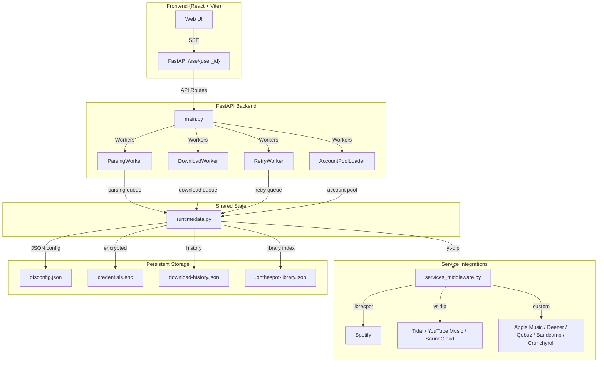

# <div align="center">

<div align="center">

[](https://github.com/ots-downloader/onthespot/stargazers)
[](https://github.com/ots-downloader/onthespot/releases)
[](https://github.com/ots-downloader/onthespot/actions)
[](https://github.com/ots-downloader/onthespot/network)
[](https://github.com/ots-downloader/onthespot/issues)
[](https://github.com/ots-downloader/onthespot/blob/main/LICENSE)
[](https://github.com/ots-downloader/onthespot/graphs/contributors)

</div>

<br/>

<div align="center">

## 🎵 A modern, easy-to-use music downloader written in Python

**OnTheSpot** is a feature-rich music downloader that supports multiple streaming services, unlike similar projects, files and metadata are sourced directly from the service of your choosing.


<a href="https://discord.gg/GCQwRBFPk9">Join Discord</a>
·
<a href="https://github.com/ots-downloader/onthespot/issues/new?assignees=&labels=bug&projects=&template=bug-report.yml">Report Bug</a>
·
<a href="https://github.com/ots-downloader/onthespot/issues/new?assignees=&labels=enhancement&projects=&template=feature_request.yml">Request Feature</a>


</div>

<br/>

## 🚀 Quick Start

### Docker Compose (recommended)

#### with Image
```
services:
  onthespot:
    container_name: onthespot
    image: moddroid94/ots-dl:latest
    user: "1000:1000"
    ports:
      - "6767:6767"
    volumes:
      - "./otsdata:/root"
    restart: unless-stopped
    stop_grace_period: 20s
    networks:
      - ots-network
  
  bgutil-ytdlp-pot-provider:
    container_name: bgutil-provider
    init: true
    image: brainicism/bgutil-ytdlp-pot-provider
    networks:
      - ots-network

networks:
  ots-network:
    driver: bridge
```

#### From Repo
```bash
git clone --branch fastapi-dev --single-branch https://github.com/ots-downloader/onthespot.git
cd onthespot
cp .env.example .env
docker compose up -d --build
```

Open `http://127.0.0.1:6767`, or the mapped address of the Docker/Unraid host.


### Standalone (Python) (not suggested)

```bash
# Clone and install
git clone --branch fastapi-dev --single-branch https://github.com/ots-downloader/onthespot.git
cd onthespot/api
uv sync

# Build Frontend
cd onthespot/ui
npm install
npm build

# Start the application
cd api/src/onthespot
uv run python main.py
```

Open `http://127.0.0.1:8000` to access the web interface.

## Screenshots


<br/>

## 📦 Features

### Music Download & Services

| Feature | Description |
|---------|-------------|
| **Multi-service search** | Search across Spotify, Tidal, Apple Music, Deezer, Qobuz, SoundCloud, YouTube Music, Bandcamp, Crunchyroll |
| **Download profiles** | Configure format, bitrate, download path per profile |
| **Path formatters** | Configurable file organization (Tracks, Albums, Movies, Shows, Podcasts) |
| **M3U playlist generation** | Auto-generate playlists with embedded metadata |
| **Video support** | Crunchyroll video downloads with chapters and subtitles |
| **YouTube Music** | Audio extraction with optional cookie authentication |


### Web Interface

| Feature | Description |
|---------|-------------|
| **Real-time queue** | SSE connections for live status updates |
| **Download controls** | Pause, resume, retry, cancel, delete, reorder, batch actions |
| **Settings page** | Full configuration of all options |
| **Diagnostics** | System health, rate limits, disk usage, worker status |
| **Log viewer** | Retrieve and download application logs |


### Spotify Connect Companion

| Feature | Description |
|---------|-------------|
| **ZeroConf discovery** | LAN-based Spotify Connect |
| **Pairing flow** | Short-lived credential payload to remote server |
| **Tailscale support** | Works across NATs and remote networks |
| **One-shot cleanup** | Auto-remove temporary companion folder after pairing |


<br/>

<div align="center">

## 🏗️ Architecture




</div>

<br/>

<br/>

<div align="center">

## 📚 Documentation

| Guide | Description |
|-------|-------------|
| [Installation Guide](docs/INSTALLATION.md) | Setup, Docker, dependencies, initial configuration |
| [Usage Guide](docs/USAGE.md) | Basic operations, download profiles, library management |
| [Feature Matrix](docs/FEATURE_MATRIX.md) | Complete feature overview per service |
| [Spotify Companion](companion/README.md) | ZeroConf Spotify Connect pairing |
| [APP Reference](/docs/SUMMARY.md) | App Technical Summary|

</div>

<br/>

<div align="center">

## 🛠️ Technology Stack

| Layer | Technology |
|-------|------------|
| **Backend** | FastAPI (Python 3.12+), yt-dlp, librespot, cryptography, ffmpeg |
| **Configuration** | JSON config + Fernet-encrypted credential store |
| **Frontend** | React 19, Vite, Astryx UI, Tailwind CSS, lucide-react icons |
| **Container** | Docker |
| **Authentication** | OAuth2, browser cookies, API tokens, ZeroConfig |
| **Rate Limiting** | Per-host request locks with shared cooldown |
| **Caching** | Disk-based HTTP response cache with TTL |
| **Logging** | Rotating file handlers + stdout, structured JSON |

</div>

<br/>

<div align="center">

## 👥 Contributing

### Ways to Help

 **🐛 Report bugs** — Open an issue with reproduction steps
 
 **💡 Request features** — Describe the desired functionality
 
 **🔧 Submit PRs** — Fix bugs, add features, improve documentation
 
 **🌐 Translate** — Help translate the UI to new languages
 
 **📊 Test** — Report on new platforms, test beta features
 
 **💬 Spread the word** — Star the repo, share with friends

### Development Setup

```bash
# 1. Fork and clone
git clone --branch fastapi-dev --single-branch https://github.com/ots-downloader/onthespot.git
cd onthespot

# 2. Install dependencies
cd api
uv sync
cd ../ui
npm install

# 3. Start development
# Terminal 1: FastAPI with auto-reload
cd api/src/onthespot
uv run python main.py

# Terminal 2: React dev server
cd ui
npm run dev

```


</div>

<br/>

<div align="center">

## 📜 License

[MIT](https://github.com/ots-downloader/onthespot/blob/main/LICENSE) © 2024 OnTheSpot Contributors

</div>

<br/>

<div align="center">

<!-- GitHub bottom section -->
<div style="display: inline-block; margin: 20px 0;">
  <a href="https://github.com/ots-downloader/onthespot/graphs/contributors">
    
  </a>
</div>

</div>

<br/>


<div align="center">
<a href="https://star-history.com/#ots-downloader/onthespot&Date">
<picture>
<source media="(prefers-color-scheme: dark)" srcset="https://api.star-history.com/svg?repos=ots-downloader/onthespot&type=Date&theme=dark" />
<source media="(prefers-color-scheme: light)" srcset="https://api.star-history.com/svg?repos=ots-downloader/onthespot&type=Date" />

</picture>
</a>

</div>
</div>

<div align="center">
<p>Made with ❤️ by the OnTheSpot community</p>
</div>

<!-- Badge references -->
[issues-shield]: https://img.shields.io/github/issues/ots-downloader/onthespot?style=flat&label=Issues&labelColor=001224&color=1DB954
[issues-url]: https://github.com/ots-downloader/onthespot/issues
[stars-shield]: https://img.shields.io/github/stars/ots-downloader/onthespot?style=flat&label=Stars&labelColor=001224&color=1DB954
[stars-url]: https://github.com/ots-downloader/onthespot/stargazers
[license-shield]: https://img.shields.io/github/license/justin025/onthespot?style=flat&label=License&labelColor=001224&color=1DB954
[downloads-shield]: https://img.shields.io/github/downloads/ots-downloader/onthespot/total.svg?style=flat&label=Downloads&labelColor=001224&color=1DB954
[downloads-url]: https://github.com/ots-downloader/onthespot/releases/
